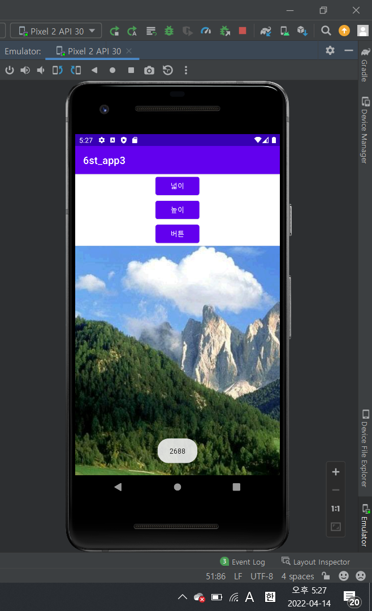
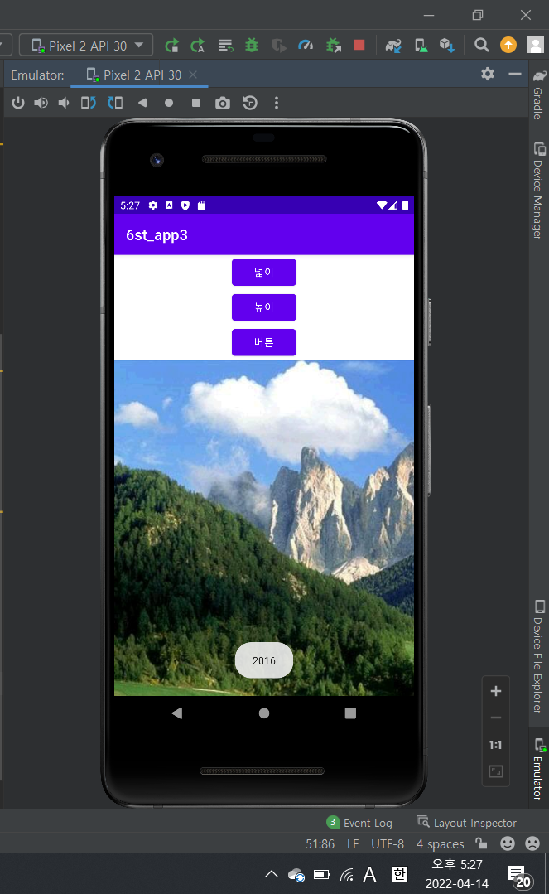
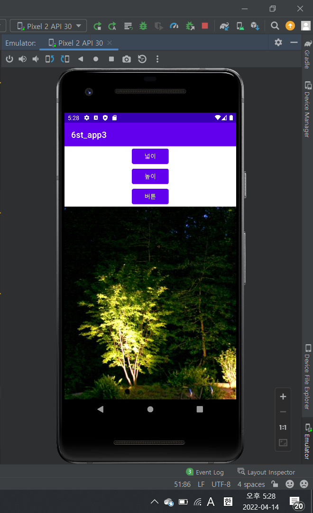
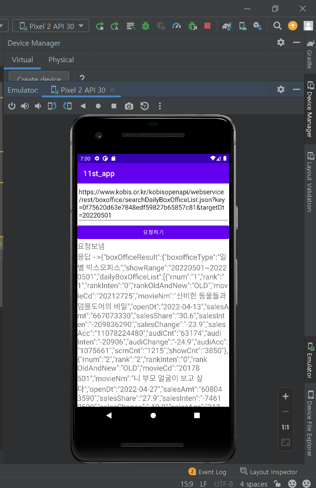

# 2주차 (2022-03-15)
  - 안드로이드 스튜디오 설치, 깃허브 저장소 생성

  </img>
  
# 3주차(2022-03-22)
  - 버튼 추가하기

  </img>
  </img>
  </img>

# 4주차 (2022-04-05)
  </img>
  </img>
  </img>
  </img>
  
# 6주차 (2022-4-14)
  </img>
  </img>
  </img>
  
# 10주차 (2022-05-17)
  </img>
  </img>
  
# 11주차 (2022-05-17)
  </img>
